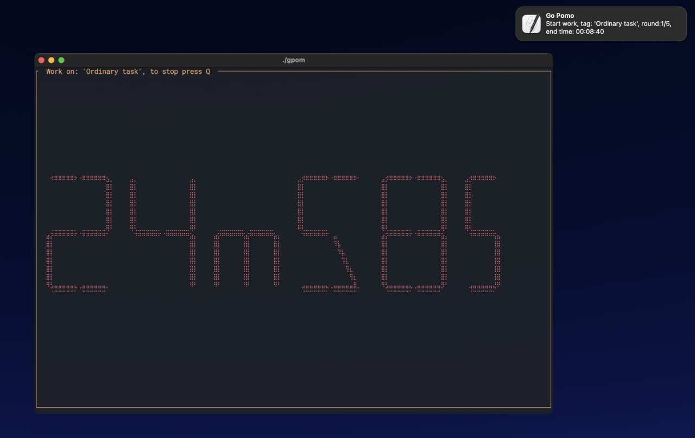

<div align="center">
  
</div>

# Go Pomodoro

Extremely simple and reliable cli pomodoro timer with notifications written in go.

### How to:
```sh
# get it
git clone https://github.com/daniilperestoronin/gpom.git
# build it
cd gpom
make build
# use it 
./gpom
```